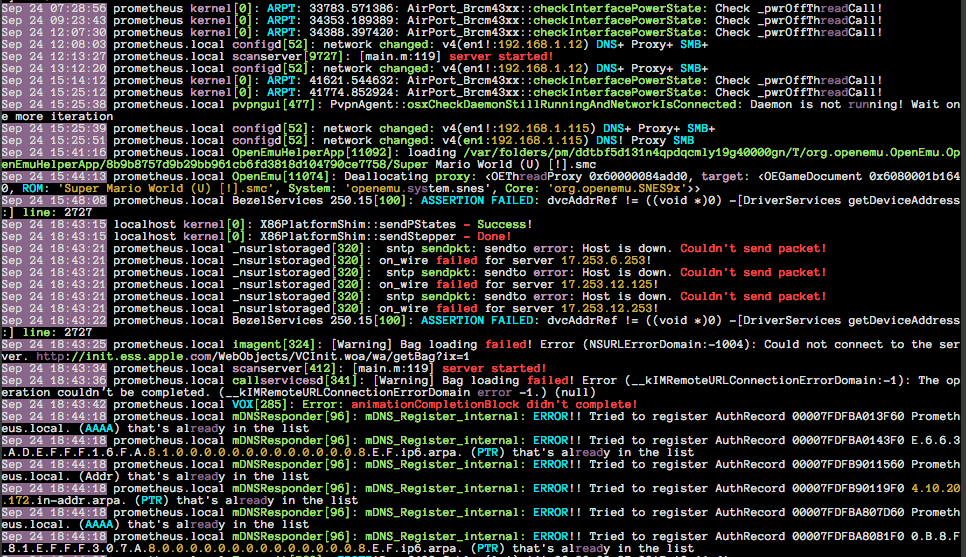
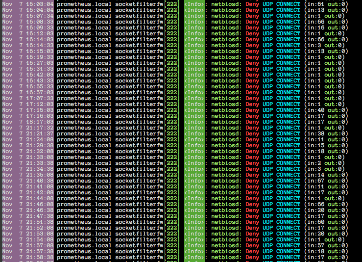
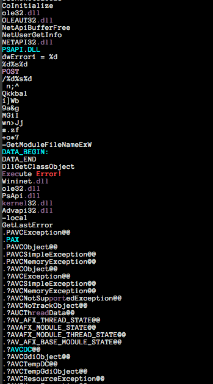
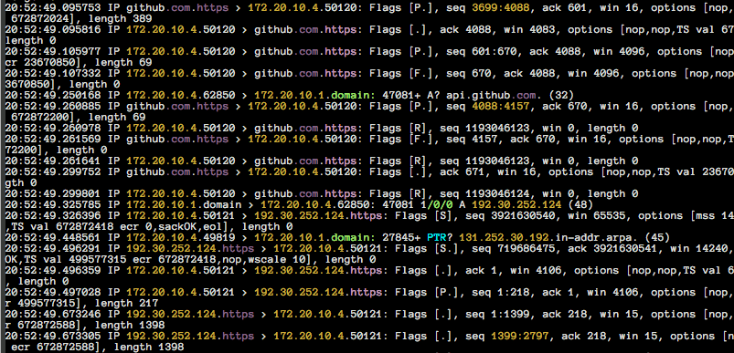
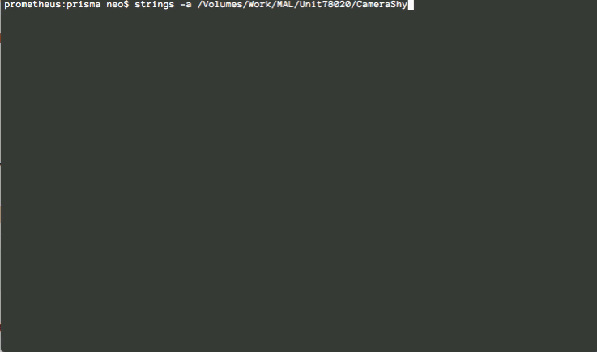

# prisma
Command Line STDOUT Colorizer

# Requirements

- [colorama](https://pypi.python.org/pypi/colorama)

# Usage
Prisma works on all platforms, Linux, OSX and Windows. 
Just pipe command line output to prisma.py

```
cat /var/log/syslog | python ./prisma.py
```

or make it executable and place it in a binary folder in order to use it anywhere you want
 
```
chmod +x ./prisma.py
sudo cp prisma.py /usr/local/bin
cat /var/log/syslog | prisma.py
```

Complete usage options
```
usage: prisma.py [-h] [-s string [string ...]] [-i] [-w seconds] [--debug]

Prisma - command line colorizer

optional arguments:
  -h, --help            show this help message and exit
  -s string [string ...]
                        Strings to highlight, separate with space (e.g. -s
                        failed error)
  -i                    Case-insensitive search for strings
  -w seconds            Pause on string match (in seconds)
  --debug               Debug output
```

Use prisma to find certain string in an output, be case-insensitive and wait 3 seconds on every match (see animated GIF below for a demo)

```
cat /var/log/messages | prisma.py -s error fail -i -w 3
``` 

# Screenshots

System log file



Firewall Log



Strings output on malware sample 



Tcpdump output



String match and wait option (animated GIF)


